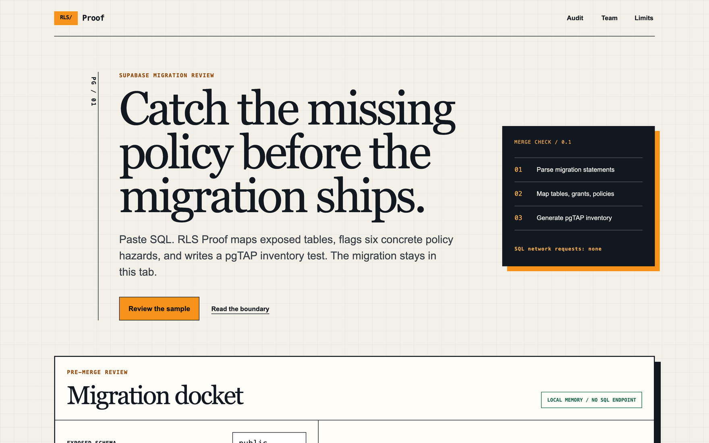

# RLS Proof

RLS Proof reviews a Supabase SQL migration before merge. It inventories exposed tables, grants, policies, and security-definer functions; reports six concrete static hazards with source lines and repairs; then generates a pgTAP policy-name test. SQL stays in browser memory and is never sent to an ingestion endpoint.

The product is for Supabase developers and implementation agencies that review migrations every week. The free workbench handles one pasted migration. No customer, completed payment, or revenue has been verified.



## Local setup

Requirements: Node.js 20.9 or later and pnpm 11.

```bash
pnpm install
cp .env.example .env.local
pnpm dev
```

Open [http://localhost:3000](http://localhost:3000). The audit needs no environment variables. `NEXT_PUBLIC_TEAM_URL` can point to a real Team checkout when one exists. Without it, the Team action opens a pilot email. `NEXT_PUBLIC_PLAUSIBLE_DOMAIN` enables aggregate event delivery; SQL and report data are not event properties.

## Implemented rules

- `RLS001`: a table is created in the selected exposed schema without RLS being enabled in the supplied migration.
- `RLS002`: RLS is enabled but no policy appears in the supplied migration.
- `RLS003`: an insert policy has no `WITH CHECK` predicate.
- `RLS004`: `anon`, `authenticated`, or `public` receives an unconditional `true` policy predicate.
- `RLS005`: a security-definer function has no explicit `SET search_path`.
- `RLS006`: an exposed role receives table privileges while the supplied migration does not enable RLS.

These checks are intentionally bounded. A clean report does not prove runtime authorization.

## Verification

```bash
pnpm format:check
pnpm lint
pnpm typecheck
pnpm test
pnpm build
pnpm audit --audit-level high
bash ./scripts/verify-signature.sh
```

`pnpm verify` runs the repository release gate. Tests cover statement boundaries, comments and literals, custom schemas, quoted identifiers, every audit rule, and deterministic pgTAP generation.

## Monetization

The Team action reads `NEXT_PUBLIC_TEAM_URL`. When unset, it opens a pilot request email instead of presenting a fake checkout. The pricing hypothesis, competitor evidence, and assumptions are recorded in [docs/OPPORTUNITY.md](docs/OPPORTUNITY.md).

## Privacy and limitations

- Migration text and audit reports stay in this browser tab. There is no SQL persistence route, account, or database.
- Static parsing can miss dynamic SQL, generated migrations, and PostgreSQL extensions outside the implemented grammar.
- pgTAP output verifies policy names only. Add behavioral tests for anonymous, authenticated, owner, and cross-tenant access.
- Run Supabase Security Advisor after deployment. RLS Proof does not inspect the live database catalog.
- Input is limited to 200,000 characters to bound browser work.
- The `X-Built-By` header percent-encodes the canonical em dash because Node HTTP headers cannot carry U+2014 directly.
- No production deployment has been verified from this repository.

Research evidence is in [docs/OPPORTUNITY.md](docs/OPPORTUNITY.md). Requirements, threats, and non-goals are in [docs/SPEC.md](docs/SPEC.md).

---

Built by Uvin Vindula — [iamuvin.com](https://iamuvin.com)
